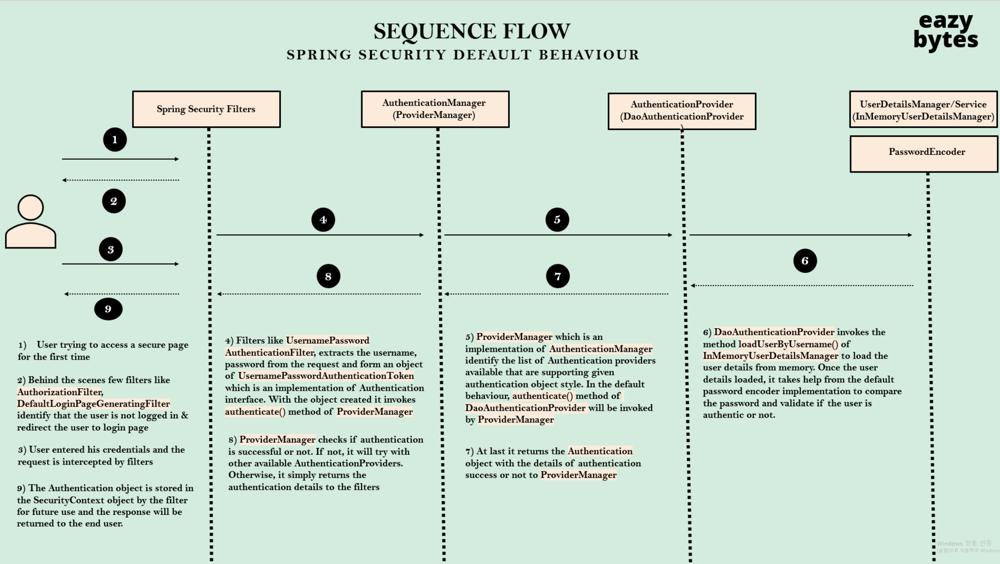
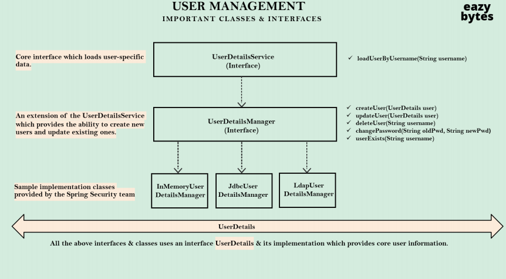
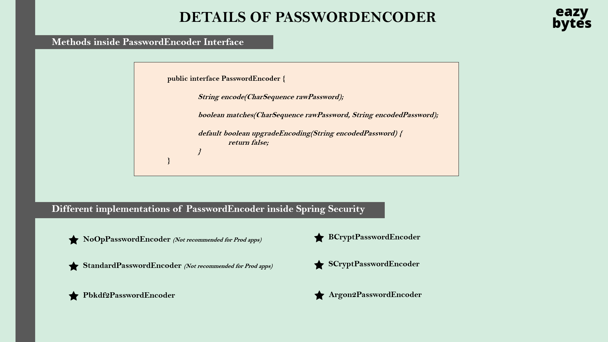

<h2> 
  
 🔐 [Udemy Spring Security 6 초보에서 마스터 되기 최신강의!](https://www.udemy.com/course/spring-security-6-jwt-oauth2-korean/) 🔐</h2>
  공부 코드입니다.

 

## Spring Security Framework를 사용하는 이유

- 보안을 프레임워크에 맡겨 개발자들이 웹 애플리케이션을 향상시키는 비즈니스 로직에 집중할 수 있다.
- 모든 보안 시나리오를 참고한 실력있는 개발자들이 제작한 프레임워크이다.
- 오픈소스 프레임워크로, 무료이다.
- CSRPF나 CORS와 같은 보안 취약저들에 대한 지속적인 업데이트가 이루어진다.
  - 새로운 보안 취약점에 대응 가능하다.
- REST API, 마이크로 서비스 등 우리의 프로젝트를 보호 가능 / 권한 부여 규칙 시해 가능
- 메소드 레벨 보안을 두번째 보안으로 보장
- 다양한 보안 기능 제공
- 인증 및 권한 부여를 구현가능 
  - JWT, Open ID 등을 구현 가능하다.

 
=> 최소 구성으로 이러한 것들을 모두 보안 가능하다.
 
 

## [서블릿과 필터]

- 요청을 HTTP 프로토콜로 전송
- Java와 요청 사이의 중재자 : '서블릿 컨테이너' or '웹 서버'
  - 브라우저로 부터 받은 HTTP메세지를 ServletRequest Object로 변환
  - 동일한 object를 웹 애플리케이션에서 사용하고 있는 자바 프레임워크에도 제고오딤
  - 다시 요청을 받으면 해당 object를 브라우저가 이해할 수 있는 HTTP메세지로 변환

- 이를 간단히 하기 위해 spring과 spring 프레임워크가 등장했다.
  - REST서비스 MVC paths와 웹 페이지를 생성
  - Spring boot와 spring프레임워크가 서블릿을 생성, 관련 로직을 담당하여 실행하게 됨.
  
- 필터 : 특별한 종류의 서블릿, 웹 애플리케이션을 향해 들어오는 모든 요청을 가로챌 수 있다.
  - 실질적 비즈니스 로직이 실행되기 전에 일어났으면 하는 프리 로직 / 프리 워크를 명시 가능
  - 웹 애플리케이션에 관한 모든 요청을 가로채는 역할을 한다.
  - 필터에 정의 내린 로직을 실행하고, 화면해서 실행된다.

<b>서블릿과 필터에 대해 잘 이해하는 것이 좋을 것이다.</b>
  

## [Spring Secyrity internal Flow]

유저는 백엔드 서버에 요청을 전송한다.  
-> spring security의 필터들이 유저가 접근하고자 하는 경로를 확인하다. 
-> 자원의 보호 여부를 판단하고 웹 페이지 접근을 관리한다.
  
인증이 성공적이었을 경우, 필터는 유저가 로그인 했는지 여부를 판단한다. 
 
스프링 시큐리티에는 20여개의 필터가 존재하고, 해당 필터는 각기 다른 역할을 갖는다. 
인증객체가 형성되면 요청을 인증 관리자에게 넘긴다.
 
<b>인증관리자</b> : 실질적 인증을 관리하는 인터페이스 혹은 클래스 
  - 인증관리자는 웹 애플리 케이션 안의 인증제공자를 확인한다. => 유효한 인증 제공자를 확인

 
<b>인증 제공자</b> 안에서 로직을 작성하거나,
Spring Security에서 제공하는 인터페이스나 클래스를 활용 가능하다.

  - 어떤 데이터베이스나 권리부여 서버 등에서 유저 자격을 증명할 수 있을지 등의 인증에 관련된 비즈니스 로직을 내부에 작성 가능
  - 애플리케이션 안에 다수의 인증 제공자가 존재 가능하다.

 
9단계 보안 컨텍스트에서
인증이 성공적이었는지 여부를 확인한다.
 
인증 객체와 함께 성공적인 인증 정보가 보안 컨텍스트에 저장되었다면
  성공적인 응답이 엔드유저에게 전송된다.
 

## [Sequence Flow]

전체적인 흐름을 각 필터들과 구조의 역할을 바탕으로 이해하면 좋을 것이다!

  

## [User Management]

- UserDetail 인터페이스와 메서드 등의 구조를 파악하여 이를 적절히 응용할 수 있도록 해야한다!
  
## [비밀번호]
- 인코딩
  - 데이터를 한 형식에서 다른 형식으로 변환하는 과정
  - 기밀성을 갖지 않는다. -> 보안에 적절하지 않다
  - 영상이나 MP3파일을 압축할 때 주로 사요한다.
    - 예) ASCII, BASE64, UNICODE 등
- 암호화
  - 데이터를 암호화할시 특정 알고리즈을 따르고, 이 암호화 알고리즘에 비밀 키를 부여
  - 이 키를 바탕으로 비밀번호를 아무도 모르는 방식으로 암호화
  - 특정 암호화 값을 알고 싶으면 복호화 해야한다.
  - 복호화를 하기 위해서는 암호화 알고리즘과 비밀 키 정보를 알아야 한다.
  - BUT 서버관리자가 해당 정보에 접근할 수 있고, 해당 변수를 다룰 수 있어 악용할 수 있다는 단점이 있으므로 추천하진 않는다.
---
- ⭐ 해싱
  - 비밀번호가 수학적 해싱을 통해 해시값으로 변환된다.
  - 최초의 텍스트 비밀번호를 다시 알아내는 것은 불가능하다.
  - => 해싱은 데디터베이스와 같은 저장소에 비밀번호를 저장하는 업계표준이 되었다.
    - 원래 비밀번호로 되돌릴 수 없다면 비밀번호를 어떻게 검증할까?
    - => 해싱 안에 옵션이 있다.
    - 비밀번호와 해싱된 값을 비교할 경우 엔드유저가 입력한 비밀번호에 해시값을 적용
    - 데이터베이스에 저장된 값과 엔드유저가 입력한 비밀번호 값을 비교
      - 동일하다면 로그인 성공
  

## [PasswordEncoder의 내부]
PasswordEncoder : 인터페이스
 
### PasswordEncoder의 메서드들
- 추상 메서드 encode : 엔드유저가 등록절차에 활용.
- matches :  유저 입력 비밀번호와 데이터베이스의 비밀번호를 비교하는데 사용
- encodedPassword / Hashpassword 매개변수 : 해시값을 비교하기 위해 사용
- upgradeEncoding : 비밀번호를 두번 해싱
  - 기본적으로 false 반환 : 한번만 해싱해도 충분해야하기 때문
  - true : 두번 해싱
  

### PasswordEncoder의 구현체들

---
#### 운영 애플리케이션에 적용 고려 불가능 - 무차별 대응 공격에 취약

---
- NoOpPasswordEncoder : 해싱, 인코딩, 암호화의 개념X / 비밀번호를 일반 텍스트로 취급 (추천X)
- StandardPasswordEncoder : 레거시 목적으로 제공될 뿐 안전하지 않다. 무작위 솔트값을 통해 햇 ㅣ알고리즘을 제공 / 시스템 전체 비밀값을 제공(추천X)
- Pblcdf2PasswordEncoder : (추천X | 과거에는 자주 사용했다)
- --
#### 운영 애플리케이션에 적용 고려 가능

----
- BCryptPasswordEncoder : Bcrypt해싱 알고리즘 활용
  - 해당 알고리즘은 다수 사용 | 컴퓨터 업데이트에 따라 업데이트함
  - 동작하는데 있어 CPU연산을 요청 => 무차별 대응 공격 방지
- SCryptPAsswordEncoder : BCryptPasswordEncoder의 고급버전
  - 해싱기능이나 matches를 사용하려 할 시 두개의 인자를 요구
    - CPU연산 능력, 메모리
- Argon2PasswordEncoder : 최신 해싱 알고리즘
  - 연산능력, 메모리, 다중 스레드 총 세가지 인자를 요구
  => 무차별 공격이 사실상 불가능
  - But! 웹 애플리케이션에게 많은 시간을 뺴앗는다는 단점

  

## [AuthenticationProvider의 내부]

인증논리를 진행할 때 중요한 개념이다. 
- authenticate 추상메소드 : 성공적인 인증정보를 생산하고 있는지 객체를 통해 확인 가능하다.
- supports 추상메소드 : 인증의 정보를 알려준다.